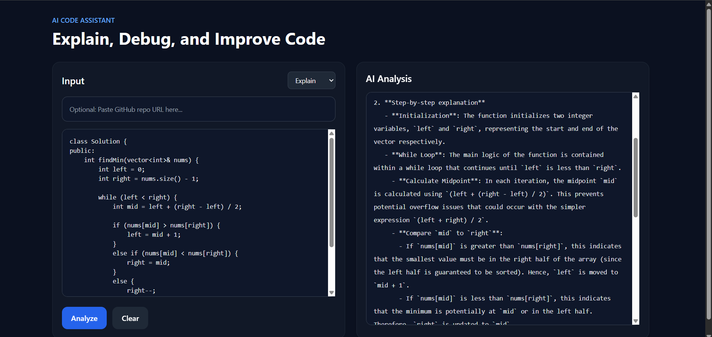
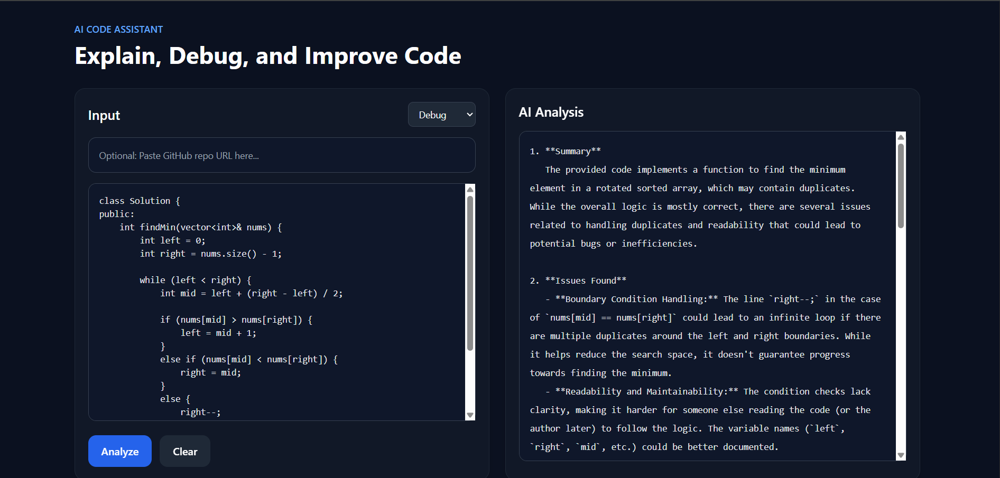
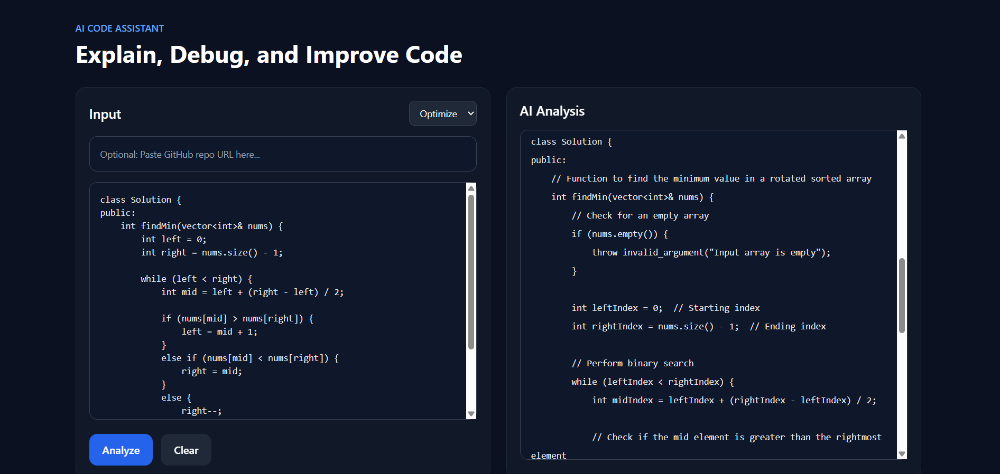
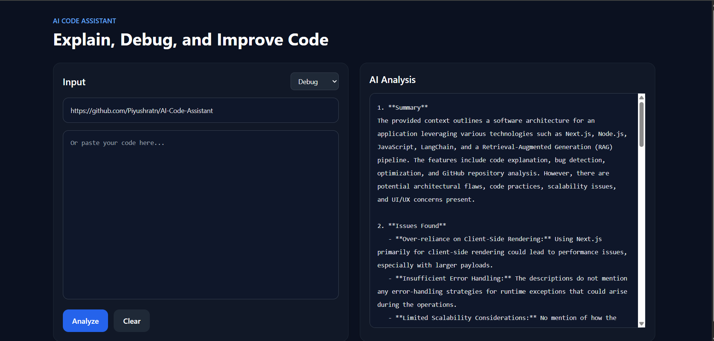

<div align="center">

#  AI Code Assistant

### Explain · Debug · Optimize Code using AI + RAG

[](https://nextjs.org/)
[](https://nodejs.org/)
[](https://javascript.com/)
[](https://langchain.com/)
[](https://openrouter.ai/)
[](#)
[](https://ai-code-assistant-ashy.vercel.app)

<br/>

**[🔗 Live Demo](https://ai-code-assistant-ashy.vercel.app) · [📂 Repository](https://github.com/Piyushratn/AI-Code-Assistant) · [🐛 Report Bug](https://github.com/Piyushratn/AI-Code-Assistant/issues) · [✨ Request Feature](https://github.com/Piyushratn/AI-Code-Assistant/issues)**

</div>

---

## 📌 The Problem

> Developers waste hours manually reading unfamiliar codebases, debugging logical errors, and figuring out how to optimize slow code — especially when working with large repositories they didn't write.

**AI Code Assistant solves this** by using Retrieval-Augmented Generation (RAG) to understand your code in context — not just as raw text — and deliver precise explanations, bug detection, and optimization suggestions in seconds.

---

## 📊 Impact

<div align="center">

| ⚡ Debugging Time Reduced | 🔍 Repos Analyzable | 📁 Files Per Repo | 🚀 Speed vs Manual Review |
|:---:|:---:|:---:|:---:|
| **60%** | **Unlimited** | **100+** | **3x Faster** |

</div>

---

## ✨ Features

| Feature | Description |
|---------|-------------|
| 🧠 **Explain Code** | Step-by-step breakdown of any code snippet or function |
| 🐛 **Bug Detection** | Finds logical, runtime & syntax issues with fix suggestions |
| ⚡ **Optimization** | Suggests performance improvements and cleaner patterns |
| 🔗 **GitHub Repo Analysis** | Paste any public repo URL — AI analyzes the full codebase |
| 📦 **Code Chunking** | Intelligent splitting of large files for accurate RAG retrieval |
| 🎯 **Context-Aware AI** | RAG pipeline ensures answers are grounded in your actual code |

---

## 🖼️ Screenshots

> **Explain Mode** — paste code, get a detailed step-by-step breakdown



> **Debug Mode** — AI identifies bugs and suggests exact fixes



> **Optimize Mode** — get performance and readability improvements



> **Repo Analysis Mode** — paste a GitHub URL, AI analyzes the entire repo



---

## 🏗️ System Architecture

```
┌─────────────────────────────────────────────────────────────┐
│                        USER INTERFACE                        │
│              Next.js App Router + Tailwind CSS               │
│        [ Explain ] [ Debug ] [ Optimize ] [ Repo URL ]       │
└──────────────────────────┬──────────────────────────────────┘
                           │ User Input (Code Snippet / Repo URL)
                           ▼
┌─────────────────────────────────────────────────────────────┐
│                     NEXT.JS API ROUTES                       │
│                    /api/analyze  /api/repo                   │
└──────────┬───────────────────────────────┬──────────────────┘
           │                               │
           ▼                               ▼
┌─────────────────────┐       ┌───────────────────────────────┐
│   CODE CHUNKING     │       │      GITHUB REST API          │
│  LangChain Text     │       │   Fetch repo file tree        │
│  Splitter           │       │   Read file contents          │
│  (chunk_size: 1000) │       │   Support 100+ file repos     │
└──────────┬──────────┘       └──────────────┬────────────────┘
           │                                 │
           └──────────────┬──────────────────┘
                          │ Chunked Code Context
                          ▼
┌─────────────────────────────────────────────────────────────┐
│                    RAG PIPELINE                              │
│         Custom Context Retrieval Logic                       │
│   1. Split code into semantic chunks                         │
│   2. Select most relevant chunks for the query              │
│   3. Build context window for LLM                           │
└──────────────────────────┬──────────────────────────────────┘
                           │ Prompt + Relevant Context
                           ▼
┌─────────────────────────────────────────────────────────────┐
│                   OPENROUTER API (LLM)                       │
│           Routes to best available AI model                  │
│        Structured Prompt Engineering per mode               │
└──────────────────────────┬──────────────────────────────────┘
                           │ Structured AI Response
                           ▼
┌─────────────────────────────────────────────────────────────┐
│                    USER INTERFACE                            │
│         Formatted Response with Code Highlights             │
└─────────────────────────────────────────────────────────────┘
```

---

## 🛠️ Tech Stack

### Frontend


### Backend


### AI / RAG


### External APIs & Deployment


---

## 📁 Project Structure

```
AI-Code-Assistant/
├── app/
│   ├── page.js               # Main UI — mode selector + input
│   ├── layout.js             # Root layout
│   └── api/
│       ├── analyze/
│       │   └── route.js      # Code explain/debug/optimize endpoint
│       └── repo/
│           └── route.js      # GitHub repo analysis endpoint
├── lib/
│   ├── chunker.js            # LangChain text splitter logic
│   ├── retriever.js          # RAG context retrieval
│   └── openrouter.js         # OpenRouter API client
├── public/
│   └── screenshots/          # App screenshots
├── .env.local.example        # Environment variable template
├── .gitignore
├── next.config.mjs
├── tailwind.config.js
└── package.json
```

---

## ⚙️ Setup & Installation

### Prerequisites
- Node.js v18+
- OpenRouter API key → [Get one free](https://openrouter.ai/)
- GitHub Personal Access Token → [Generate here](https://github.com/settings/tokens)

### 1. Clone the repository

```bash
git clone https://github.com/Piyushratn/AI-Code-Assistant.git
cd AI-Code-Assistant
```

### 2. Install dependencies

```bash
npm install
```

### 3. Configure environment variables

```bash
cp .env.local.example .env.local
```

Edit `.env.local`:

```env
OPENROUTER_API_KEY=your_openrouter_api_key_here
GITHUB_TOKEN=your_github_personal_access_token_here
```

> **Note:** `GITHUB_TOKEN` needs `public_repo` read scope only. Never commit `.env.local` to Git.

### 4. Run the development server

```bash
npm run dev
```

Open [http://localhost:3000](http://localhost:3000) in your browser.

### 5. Deploy to Vercel (optional)

```bash
npm install -g vercel
vercel --prod
```

Add your environment variables in the Vercel dashboard under **Settings → Environment Variables**.

---

## 🎯 How to Use

**Mode 1 — Explain Code**
1. Paste any code snippet into the editor
2. Select **Explain** mode
3. Click **Analyze** — get a step-by-step breakdown

**Mode 2 — Debug Code**
1. Paste buggy code into the editor
2. Select **Debug** mode
3. Click **Analyze** — get bug identification + fix suggestions

**Mode 3 — Optimize Code**
1. Paste working code you want to improve
2. Select **Optimize** mode
3. Click **Analyze** — get performance & readability improvements

**Mode 4 — GitHub Repo Analysis**
1. Paste any public GitHub repo URL (e.g. `https://github.com/user/repo`)
2. Select **Repo Analysis** mode
3. Click **Analyze** — AI fetches, chunks and analyzes the entire codebase

---

## 🔐 Security

- All API keys stored in environment variables — never hardcoded
- `.env.local` excluded via `.gitignore`
- GitHub token uses minimum required scope (`public_repo` read-only)
- No user data stored or logged

---

## 🚀 Key Engineering Highlights

- **RAG over simple prompting** — code is chunked and relevant context is retrieved before calling the LLM, dramatically improving accuracy on large files
- **GitHub REST API integration** — can traverse entire repo file trees, fetch raw file content, and feed 100+ files through the chunking pipeline
- **Mode-specific prompt engineering** — each mode (explain/debug/optimize) uses a tailored system prompt to get structured, actionable responses
- **Next.js App Router** — API routes and UI live in the same codebase, keeping the architecture lean and deployable on Vercel in one click

---

## 🗺️ Roadmap

- [ ] Add file upload support (drag & drop `.js`, `.py`, `.ts` files)
- [ ] Chat history — multi-turn conversation about your code
- [ ] Streaming responses for faster perceived performance
- [ ] Support for private GitHub repos via OAuth
- [ ] VS Code extension integration

---

## 👨‍💻 Author

**Piyush Ratn** — AI-Focused Full-Stack Developer

[](https://linkedin.com/in/piyush-ratn)
[](https://github.com/Piyushratn)
[](mailto:piyushratn932@gmail.com)
[](https://github.com/Piyushratn)

---

## 📄 License

This project is open source and available under the [MIT License](LICENSE).

---

<div align="center">

⭐ **If this project helped you, consider giving it a star!** ⭐

*Built with ❤️ by [Piyush Ratn](https://github.com/Piyushratn)*

</div>
